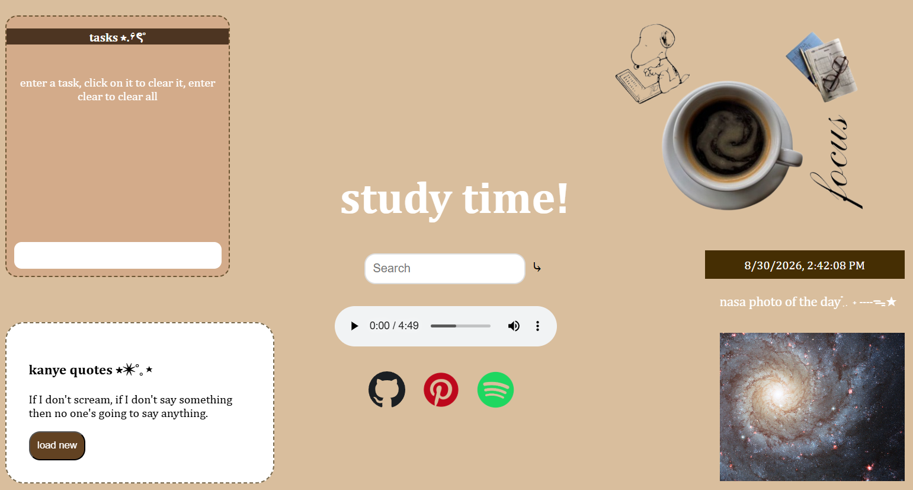

This is a personalized search-engine style tab that is designed for productivity created in HTML, CSS, and JavaScript with the help of the Nasa APOD API.

To view this project, visit https://krupa-pramod.github.io/krupas-os/
Simply click the link to open the project in your web.

Features include:
- an opening window that greets the user and provides a brief description of myself
- an app that contains song recommendations
- an app that contains the books and movies I am currently interested in
- the ability to drag, open, and close windows
- a navigation bar including app opening icons and the time which updates every second
- a password protected lock screen
- a terminal
- file explorer with sub-files

What inspired me to make this is the need for a centralized study place where I can search things up and have websites that I access often and useful features such as tasks and a to-do list which I use often while studying. Also something that is visually appealing is motivating for me and things such as quotes/images are nice to have in a study environment. This prompted me to put together the features I enjoy across multiple productivity sites all into one.

Future changes may include:
- adding multiple search engines
- adding a timer feature to time study sessions
- linked spotify playlist/more music

The content is all written in HTML, styled in CSS, and functionalities such as draggable windows, updating time, and open/close functions are all designed in Javascript. The web is then hosted on Git Pages.

Website was developed locally with the help of Vite and then hosted on Github Pages.
Navigating Vite and some other features was guided with the help of Hack Club's Stardance program.
